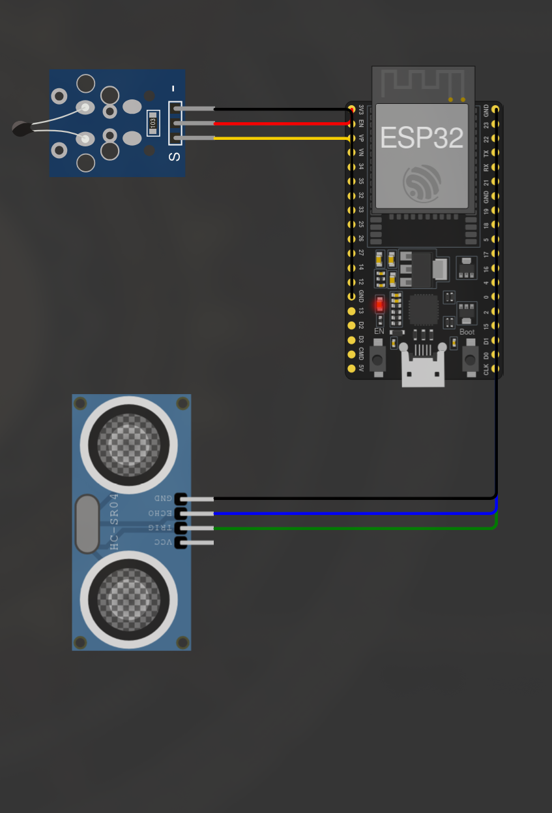
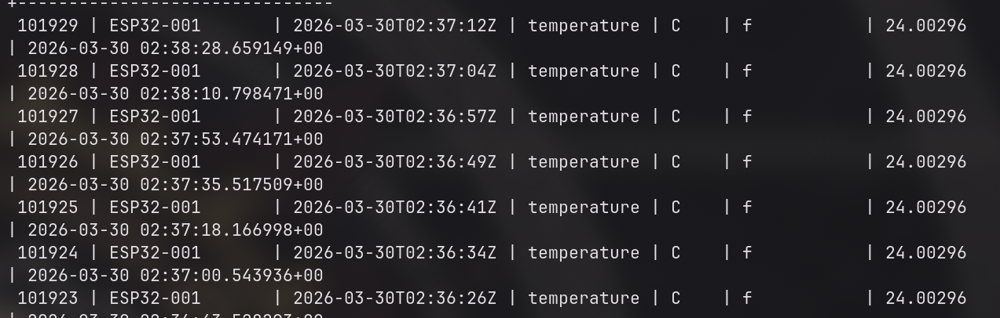

# pondFilaESP

Firmware ESP32 (Arduino) que lê sensores reais — **HC-SR04** (presença por ultrassom) e **NTC** (temperatura) — e envia telemetria via HTTP POST para o backend [pondRabbitMQServices](https://github.com/cucapcosta/pondRabbitMQServices).

## Circuito



| Componente | Pino ESP32 | Função |
|---|---|---|
| HC-SR04 TRIG | GPIO5 | Disparo do pulso ultrassônico |
| HC-SR04 ECHO | GPIO18 | Retorno do pulso (ISR CHANGE) |
| NTC OUT | GPIO34 | Leitura analógica (ADC 12-bit) |

## Funcionamento



O firmware roda em **loop não-bloqueante**:

1. **HC-SR04** — trigger a cada 250ms; ISR (`attachInterrupt`) captura `micros()` no rising/falling do ECHO para medir distância. Debounce de 3 leituras consecutivas iguais antes de confirmar mudança de presença.
2. **NTC** — timer de hardware (`hw_timer_t`, 5s) seta uma flag; o loop lê o ADC 12-bit, aplica fórmula Beta (Steinhart-Hart simplificada) e média móvel de 5 amostras.
3. **Fila circular** — ring buffer de 10 slots desacopla leitura de envio. Sensores fazem `push`, o loop faz `pop` e envia.
4. **WiFi** — máquina de estados (`DISCONNECTED → CONNECTING → CONNECTED`) com reconexão automática e backoff crescente (até 10 retries).
5. **HTTP POST** — JSON montado com ArduinoJson, timestamp real via NTP (`configTime`), retry 3x em caso de falha.

## Payload

```json
{
  "SensorID": "ESP32-001",
  "Timestamp": "2026-03-30T12:00:00Z",
  "Type": "temperature",
  "Unit": "C",
  "IsDiscrete": false,
  "Value": 24.3
}
```

## Configuração

Edite os `#define` no topo de `sketch.ino`:

```c
#define WIFI_SSID   "Wokwi-GUEST"
#define WIFI_PASS   ""
#define SERVER_URL  "http://192.168.1.100:3420/add"
#define SENSOR_ID   "ESP32-001"
```

Para usar com ngrok/tunnel, troque `SERVER_URL` pela URL do tunnel.

## Rodar no Wokwi

1. Abra o projeto no [Wokwi](https://wokwi.com/) como Arduino ESP32
2. O `diagram.json` já tem o circuito configurado (ESP32 + NTC + HC-SR04)
3. Use os sliders dos sensores para testar:
   - HC-SR04 < 30 cm → log de presença + POST
   - NTC slider → temperatura a cada 5s + POST
4. Desconectar WiFi → reconexão automática visível no Serial

## Estrutura

```
sketch.ino      — Firmware completo (Arduino)
diagram.json    — Circuito Wokwi (ESP32 + NTC + HC-SR04)
wokwi.toml      — Configuração Wokwi
images/         — Screenshots do circuito e serial
```
